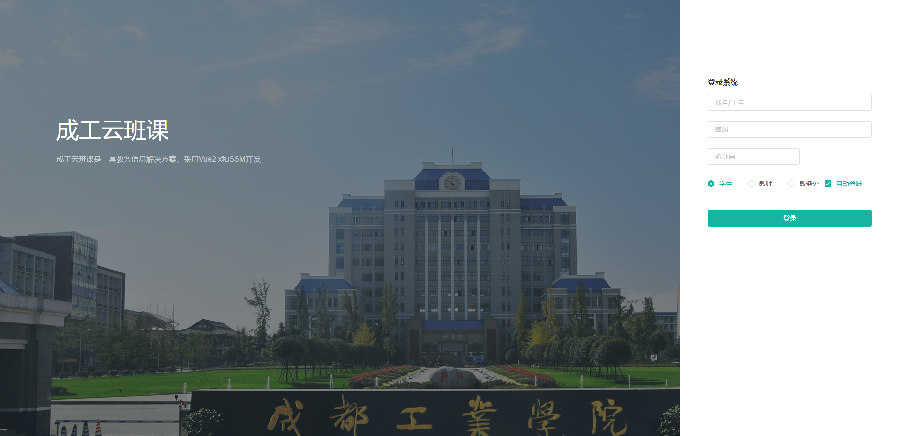

## 成工云班课
- 基于vue、element-ui构建开发，实现学生，教师，教务处三角色功能，提供一套教务信息解决方案
- 前后端分离，通过token进行数据交互，可独立部署
- 主题定制，通过scss变量统一一站式定制
- 动态菜单，通过菜单管理统一管理访问路由
- 数据切换，通过mock配置对接口数据／mock模拟数据进行切换
- 发布时，可动态配置CDN静态资源／切换新旧版本
- tab式数据，抛弃旧式多级多量菜单

## 说明文档

##### 配置

拉取代码至任意目录

使用WebStrom打开项目文件，配置static/config下的各种环境下的接口地址

如果不改动则为localhost:8080/JobSubmissionSystem

其中JobSubmissionSystem为后端项目名称

##### 部署

输入命令

cnpm install 

cnpm run dev

打开浏览器http://localhost:8080即可预览效果 有任何问题请Issues或者联系QQ:825552510 

